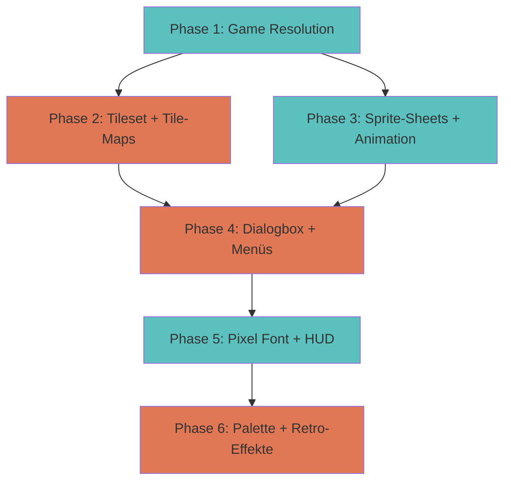

# Plan: Grafische Spieloberfläche im Stil von Pokemon Gold/Silber und Ruby/Saphir

**Datum:** 2026-02-01  
**Status:** Zur Genehmigung  
**Version:** 1.0

## Zusammenfassung

Umbau der bestehenden Overworld- und Reader-UI zu einer Pokemon-artigen Spieloberfläche mit:
- Fester Game-Resolution (240×160) mit Integer-Skalierung
- Echte Tile-Maps statt proceduraler Rechtecke
- Sprite-Sheets mit Laufanimationen
- Pokemon-artige Dialogbox und Menüs
- Pixel-Typografie für UI-Elemente
- Konsistente Palette mit optionalen Retro-Effekten

## Annahmen für die Implementierung

| Bereich | Entscheidung | Begründung |
|---------|--------------|--------------|
| Auflösung | 240×160 (GBA) | Bessere GBA-Assoziation, 15×10 Tiles bei 16×16 |
| Tile-Map Format | JSON/CSV (einfach) | Schnelle Implementierung, später optional Tiled |
| Sprite-Frames | 2 pro Richtung | Einfach zu erstellen, ausreichend für Prototyp |
| Dialogbox | Overlay über Viewport | Flexibler, Compose-native |
| Pixel-Font | Nur UI-Elemente | Narrative bleibt bei Lora für Lesbarkeit |
| Retro-Effekte | Settings-Option | Ein/aus schaltbar |
| Assets | Procedural Placeholder | Schneller Start, echte Assets später |
| Phasen | 1-4 zuerst | Spielbares Fundament, Rest optional |

---

## Architektur-Übersicht



---

## Phase 1: Feste Spielauflösung und Integer-Skalierung

### 1.1 Game-Resolution Konstanten definieren
**Datei:** `android-native/app/src/main/java/de/daydaylx/nachtzug19/ui/overworld/OverworldConstants.kt` (neu)

```kotlin
object GameResolution {
    const val WIDTH = 240
    const val HEIGHT = 160
    const val TILE_SIZE = 16
    const val TILES_X = WIDTH / TILE_SIZE  // 15
    const val TILES_Y = HEIGHT / TILE_SIZE  // 10
}
```

### 1.2 Integer-Scale-Logik implementieren
**Datei:** `android-native/app/src/main/java/de/daydaylx/nachtzug19/ui/overworld/GameViewport.kt` (neu)

- Composable für Game-Viewport mit fester Größe
- Integer-Scale-Berechnung: `scale = min(screenWidth/240, screenHeight/160)` abgerundet
- Letterbox-Hintergrund (schwarze Ränder)
- Touch-Koordinaten-Umrechnung: Screen → Viewport → Tile

### 1.3 OverworldRenderer an Game-Viewport anpassen
**Datei:** `android-native/app/src/main/java/de/daydaylx/nachtzug19/ui/overworld/OverworldScreen.kt`

- `OverworldRenderer` in `GameViewport` einbetten
- `visibleTiles` von 11 auf 15 ändern (entspricht 240×160)
- `tileSizePx` basierend auf Game-Resolution berechnen

### 1.4 Dokumentation aktualisieren
**Datei:** `docs/UI_VISUAL_OVERWORLD_Z1.md`

- Auflösung von 320×180 auf 240×160 ändern
- Integer-Scale-Regel dokumentieren
- Letterbox-Konzept beschreiben

---

## Phase 2: Echte Tile-Maps statt proceduraler Rechtecke

### 2.1 Tileset-Struktur definieren
**Datei:** `android-native/app/src/main/java/de/daydaylx/nachtzug19/ui/overworld/Tileset.kt` (neu)

```kotlin
data class Tileset(
    val id: String,
    val tileSize: Int = 16,
    val tiles: List<TileDefinition>
)

data class TileDefinition(
    val id: Int,
    val type: TileType,
    val color: Color,
    val variant: Int = 0  // Für verschiedene Boden-Varianten
)

enum class TileType {
    FLOOR_A, FLOOR_B, WALL_TOP, WALL_BOTTOM, 
    WALL_LEFT, WALL_RIGHT, DOOR, WINDOW, SEAT
}
```

### 2.2 Tile-Map Datenstruktur
**Datei:** `android-native/app/src/main/java/de/daydaylx/nachtzug19/ui/overworld/TileMap.kt` (neu)

```kotlin
data class TileMap(
    val width: Int,
    val height: Int,
    val tiles: IntArray  // Flattened 2D array
)

fun TileMap.getTile(x: Int, y: Int): Int {
    return tiles[y * width + x]
}
```

### 2.3 Tileset-Rendering implementieren
**Datei:** `android-native/app/src/main/java/de/daydaylx/nachtzug19/ui/overworld/TileRenderer.kt` (neu)

- `DrawScope.drawTile(tileId: Int, position: Offset, tileSize: Float)`
- Procedural Tiles als Fallback (Farben aus `TileDefinition`)
- Vorbereitung für Bitmap-basiertes Rendering (später)

### 2.4 OverworldData auf Tile-Maps umstellen
**Datei:** `android-native/app/src/main/java/de/daydaylx/nachtzug19/ui/overworld/OverworldData.kt`

- `RoomDefinition` um `tileMap: TileMap` erweitern
- Pro Raum Tile-Map als IntArray definieren (z.B. 15×10 = 150 Werte)
- Beispiel für Korridor-Hauptgang:
  ```kotlin
  val corridorMainMap = TileMap(
      width = 15,
      height = 10,
      tiles = intArrayOf(
          0,0,0,0,0,0,0,0,0,0,0,0,0,0,0,0,  // Oben (Wand)
          0,1,2,1,2,1,2,1,2,1,2,1,2,1,0,  // Reihe 1
          0,2,1,2,1,2,1,2,1,2,1,2,1,2,0,  // Reihe 2
          // ... weitere Reihen
          0,0,0,0,0,0,0,0,0,0,0,0,0,0,0,0   // Unten (Wand)
      )
  )
  ```

### 2.5 drawRoom auf Tile-Map Rendering umstellen
**Datei:** `android-native/app/src/main/java/de/daydaylx/nachtzug19/ui/overworld/OverworldScreen.kt`

- `drawRoom()` durch `TileRenderer.drawTileMap()` ersetzen
- Procedural `drawRect`-Logik entfernen
- Tile-IDs aus `room.tileMap.tiles` lesen

---

## Phase 3: Sprite-Sheets und Laufanimationen

### 3.1 Sprite-Sheet Datenstruktur
**Datei:** `android-native/app/src/main/java/de/daydaylx/nachtzug19/ui/overworld/SpriteSheet.kt` (neu)

```kotlin
data class SpriteSheet(
    val width: Int,      // Breite pro Frame
    val height: Int,     // Höhe pro Frame
    val framesPerDirection: Int,
    val directions: Int,   // 4: unten, oben, links, rechts
    val pixels: List<Color?>  // Flattened: [dir][frame][pixel]
)

enum class Direction {
    DOWN, UP, LEFT, RIGHT
}
```

### 3.2 Animation-State für Player
**Datei:** `android-native/app/src/main/java/de/daydaylx/nachtzug19/ui/overworld/OverworldModels.kt`

```kotlin
data class AnimationState(
    val direction: Direction = Direction.DOWN,
    val frameIndex: Int = 0,
    val isMoving: Boolean = false,
    val frameCounter: Int = 0
)
```

### 3.3 Sprite-Sheet Rendering
**Datei:** `android-native/app/src/main/java/de/daydaylx/nachtzug19/ui/overworld/SpriteRenderer.kt` (neu)

- `DrawScope.drawSpriteSheet(sprite: SpriteSheet, state: AnimationState, position: Offset, tileSize: Float)`
- Frame-Index basierend auf `frameCounter` berechnen (alle 4-8 Ticks wechseln)
- Laufrichtung aus `stepTowards` ableiten

### 3.4 PixelAssets auf Sprite-Sheets umstellen
**Datei:** `android-native/app/src/main/java/de/daydaylx/nachtzug19/ui/overworld/PixelAssets.kt`

- `PixelSprite` durch `SpriteSheet` ersetzen
- Pro Charakter 2 Frames × 4 Richtungen = 8 Frames
- Procedural Generierung als Fallback behalten

### 3.5 OverworldState um AnimationState erweitern
**Datei:** `android-native/app/src/main/java/de/daydaylx/nachtzug19/ui/overworld/OverworldModels.kt`

```kotlin
data class OverworldState(
    // ... bestehende Felder
    val animationState: AnimationState = AnimationState()
)
```

### 3.6 Laufrichtung in stepTowards ableiten
**Datei:** `android-native/app/src/main/java/de/daydaylx/nachtzug19/ui/overworld/OverworldScreen.kt`

- `stepTowards()` um `Direction`-Rückgabe erweitern
- `OverworldState.animationState` bei Bewegung aktualisieren

---

## Phase 4: Pokemon-artige Dialogbox und Menüs

### 4.1 PixelDialogBox Komponente
**Datei:** `android-native/app/src/main/java/de/daydaylx/nachtzug19/ui/components/PixelDialogBox.kt` (neu)

```kotlin
@Composable
fun PixelDialogBox(
    title: String?,
    narrative: String,
    modifier: Modifier = Modifier
) {
    // Unten platzierte Box mit 2-3 px Rahmen
    // Pixel-Rahmen: dunkler Rand + hellerer Innenrand
    // Abgerundete Ecken im Pixel-Stil (4-8 px Radius)
    // Hintergrund: dunkles Grau/Anthrazit
}
```

### 4.2 PixelMenu Komponente
**Datei:** `android-native/app/src/main/java/de/daydaylx/nachtzug19/ui/components/PixelMenu.kt` (neu)

```kotlin
@Composable
fun PixelMenu(
    options: List<String>,
    selectedIndex: Int,
    onSelect: (Int) -> Unit,
    modifier: Modifier = Modifier
) {
    // Kompakte Menüzeilen untereinander
    // Cursor: kleines Dreieck/Pfeil links neben Auswahl
    // Highlight-Zeile mit anderer Hintergrundfarbe
    // Tap = Auswahl
}
```

### 4.3 SceneOverlay auf PixelDialogBox umstellen
**Datei:** `android-native/app/src/main/java/de/daydaylx/nachtzug19/ui/overworld/OverworldScreen.kt`

- `ReaderCard` durch `PixelDialogBox` ersetzen
- `TicketChoice` durch `PixelMenu` ersetzen
- Cursor-State für Menü-Auswahl hinzufügen

### 4.4 PlayerScreen auf PixelDialogBox umstellen
**Datei:** `android-native/app/src/main/java/de/daydaylx/nachtzug19/ui/PlayerScreen.kt`

- `ReaderCard` in `StoryReader` durch `PixelDialogBox` ersetzen
- `ChoiceTray` durch `PixelMenu` ersetzen
- Konsistente Optik mit Overworld

### 4.5 Dialogbox-Positionierung
**Datei:** `android-native/app/src/main/java/de/daydaylx/nachtzug19/ui/components/PixelDialogBox.kt`

- Feste Höhe (z.B. 60-80 px)
- Unten im Game-Viewport oder als Overlay
- Padding für Lesbarkeit

---

## Phase 5: Pixel-Typografie und HUD

### 5.1 Pixel-Font hinzufügen
**Datei:** `android-native/app/src/main/res/font/` (neue Dateien)

- Pixel-Font als TTF herunterladen (z.B. "Press Start 2P" oder "Silkscreen")
- In `res/font/` ablegen

### 5.2 Typography.kt erweitern
**Datei:** `android-native/app/src/main/java/de/daydaylx/nachtzug19/ui/theme/Typography.kt`

```kotlin
val PixelFont = FontFamily(
    Font(R.font.pixel_font, FontWeight.Normal)
)

val NachtzugTypography = Typography(
    // ... bestehende
    // Pixel-Styles für UI
    pixelLabel = TextStyle(
        fontFamily = PixelFont,
        fontWeight = FontWeight.Normal,
        fontSize = 12.sp,
        lineHeight = 16.sp
    ),
    pixelTitle = TextStyle(
        fontFamily = PixelFont,
        fontWeight = FontWeight.Bold,
        fontSize = 14.sp,
        lineHeight = 18.sp
    )
)
```

### 5.3 PixelHUD Komponente
**Datei:** `android-native/app/src/main/java/de/daydaylx/nachtzug19/ui/components/PixelHUD.kt` (neu)

```kotlin
@Composable
fun PixelHUD(
    chapter: String,
    stationName: String,
    tickets: Int,
    drift: Int,
    modifier: Modifier = Modifier
) {
    // Schmaler Streifen oben im Pixel-Stil
    // Pixel-Rahmen, Pixel-Schrift
    // Kleine Icons (Tickets, Drift, Attention)
}
```

### 5.4 OverworldScreen TopAppBar ersetzen
**Datei:** `android-native/app/src/main/java/de/daydaylx/nachtzug19/ui/overworld/OverworldScreen.kt`

- Material `TopAppBar` durch `PixelHUD` ersetzen
- Kapitel, Stationsname, Status anzeigen

### 5.5 PlayerScreen TopAppBar ersetzen
**Datei:** `android-native/app/src/main/java/de/daydaylx/nachtzug19/ui/PlayerScreen.kt`

- Material `TopAppBar` durch `PixelHUD` ersetzen
- Konsistentes HUD in beiden Screens

### 5.6 Pixel-Font in UI-Komponenten anwenden
**Dateien:** `PixelDialogBox.kt`, `PixelMenu.kt`, `PixelHUD.kt`

- UI-Texte mit `pixelLabel` / `pixelTitle`
- Narrative-Text bleibt bei Lora (für Lesbarkeit)

---

## Phase 6: Palette und optionaler Retro-Effekt

### 6.1 Spiel-Palette definieren
**Datei:** `android-native/app/src/main/java/de/daydaylx/nachtzug19/ui/theme/GamePalette.kt` (neu)

```kotlin
object GamePalette {
    // Nachtzug-Palette (16-32 Farben)
    val BACKGROUND = Color(0xFF0A0F16)
    val FLOOR_A = Color(0xFF1B222C)
    val FLOOR_B = Color(0xFF232A36)
    val WALL = Color(0xFF2A3039)
    val ACCENT_NEON = Color(0xFF5BC0BE)
    val ACCENT_ORANGE = Color(0xFFE07856)
    val PLAYER = Color(0xFFE8C07D)
    val NPC = Color(0xFF6FCF97)
    val WARNING = Color(0xFFD32F2F)
    
    // Drift-Palette (Memory Drift >= 3)
    val DRIFT_BACKGROUND = Color(0xFF0D1218)
    val DRIFT_FLOOR_A = Color(0xFF151A22)
    val DRIFT_FLOOR_B = Color(0xFF1D222B)
}
```

### 6.2 Palette in OverworldData anwenden
**Datei:** `android-native/app/src/main/java/de/daydaylx/nachtzug19/ui/overworld/OverworldData.kt`

- `WorldPalette` durch `GamePalette` ersetzen
- Tile-Definitionen mit `GamePalette`-Farben

### 6.3 Memory Drift Palette-Swap
**Datei:** `android-native/app/src/main/java/de/daydaylx/nachtzug19/ui/overworld/OverworldScreen.kt`

- In `drawRoom()` bei `driftLevel >= 3` `GamePalette.DRIFT_*` verwenden
- Keine neuen Assets nötig, nur Farb-Shift

### 6.4 Retro-Effekt Overlay (optional)
**Datei:** `android-native/app/src/main/java/de/daydaylx/nachtzug19/ui/components/RetroOverlay.kt` (neu)

```kotlin
@Composable
fun RetroOverlay(
    enabled: Boolean,
    modifier: Modifier = Modifier
) {
    // Scanlines: halbtransparente horizontale Linien
    // Vignette: dunkle Ränder
    // Als Settings-Option steuerbar
}
```

### 6.5 Settings um Retro-Toggle erweitern
**Datei:** `android-native/app/src/main/java/de/daydaylx/nachtzug19/model/Models.kt`

```kotlin
data class ReaderSettings(
    // ... bestehende
    val retroEffects: Boolean = false
)
```

### 6.6 Dokumentation der Palette
**Datei:** `docs/GAME_PALETTE_SPEC.md` (neu)

- Alle Farben mit Hex-Werten dokumentieren
- Drift-Varianten beschreiben
- Verwendungszwecke auflisten

---

## Datei-Übersicht

### Neue Dateien
```
android-native/app/src/main/java/de/daydaylx/nachtzug19/ui/overworld/
  - OverworldConstants.kt
  - GameViewport.kt
  - Tileset.kt
  - TileMap.kt
  - TileRenderer.kt
  - SpriteSheet.kt
  - SpriteRenderer.kt

android-native/app/src/main/java/de/daydaylx/nachtzug19/ui/components/
  - PixelDialogBox.kt
  - PixelMenu.kt
  - PixelHUD.kt
  - RetroOverlay.kt

android-native/app/src/main/java/de/daydaylx/nachtzug19/ui/theme/
  - GamePalette.kt

android-native/app/src/main/res/font/
  - pixel_font.ttf (oder .otf)

docs/
  - GAME_PALETTE_SPEC.md
```

### Zu ändernde Dateien
```
android-native/app/src/main/java/de/daydaylx/nachtzug19/ui/overworld/
  - OverworldScreen.kt
  - OverworldData.kt
  - OverworldModels.kt
  - PixelAssets.kt

android-native/app/src/main/java/de/daydaylx/nachtzug19/ui/
  - PlayerScreen.kt

android-native/app/src/main/java/de/daydaylx/nachtzug19/ui/theme/
  - Typography.kt

docs/
  - UI_VISUAL_OVERWORLD_Z1.md
```

---

## Abhängigkeiten und Konflikte

### Abhängigkeiten
- Phase 1 muss vor Phase 2-6 abgeschlossen sein
- Phase 2 und 3 können parallel entwickelt werden
- Phase 4 benötigt Phase 1-3
- Phase 5 benötigt Phase 4
- Phase 6 ist optional, kann jederzeit integriert werden

### Konflikte mit bestehender Spec
- **Reader Noir:** Konzept bleibt (Nacht, Zug, ruhige Spannung), Optik wird "mehr Spiel"
- **Z1 (320×180):** Wird auf 240×160 geändert für GBA-Assoziation
- **BACKGROUND_ASSETS_SPEC.md:** Kann weiter gelten, wenn Hintergrundbilder unter Game-Viewport genutzt werden

---

## Test-Checkliste

Nach jeder Phase:
- [ ] Game-Viewport korrekt skaliert (Integer-Scale)
- [ ] Letterbox korrekt angezeigt
- [ ] Touch-Koordinaten präzise
- [ ] Tiles korrekt gerendert
- [ ] Sprites mit Animationen
- [ ] Dialogbox mit Rahmen
- [ ] Menü mit Cursor
- [ ] Pixel-Font geladen
- [ ] HUD angezeigt
- [ ] Palette konsistent
- [ ] Retro-Effekt ein/aus

---

## Nächste Schritte

1. **Genehmigung des Plans:** Benutzer prüft und gibt Feedback
2. **Anpassungen:** Plan wird basierend auf Feedback verfeinert
3. **Implementierung:** Wechsel zu Code-Mode für Umsetzung
4. **Testing:** Überprüfung aller Phasen
5. **Dokumentation:** Aktualisierung aller Specs
